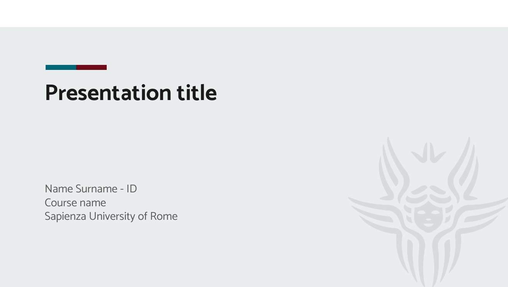
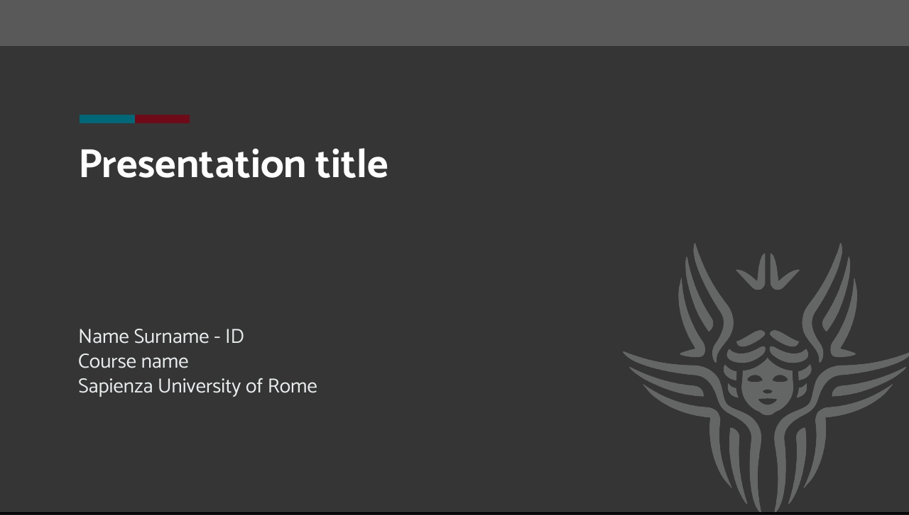
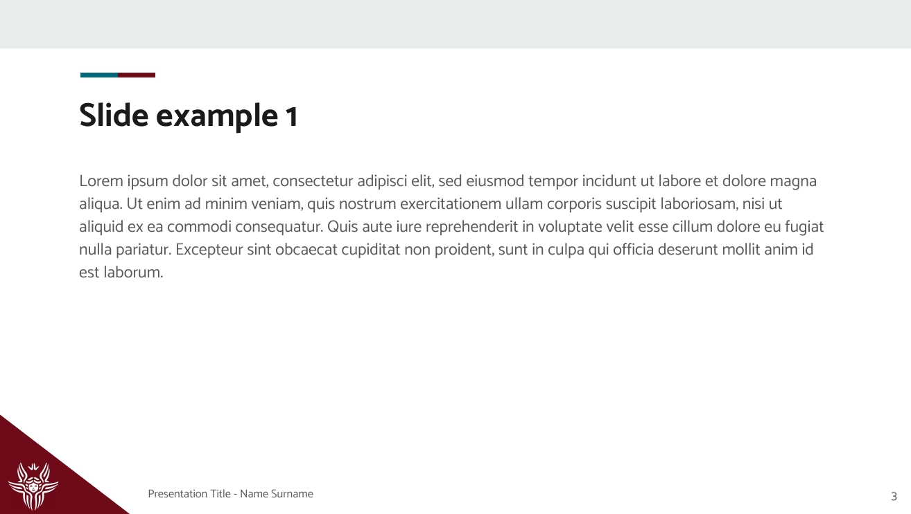
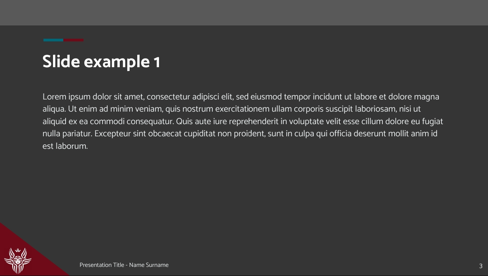

# **sapienza-ppt-template** :information_desk_person: :bar_chart: :computer: :mortar_board: :rocket:

 
## Introduzione
Slide template (non ufficiale) per l'Università degli Studi di Roma "La Sapienza" :star:.

E stato sviluppato usando [google slides](https://docs.google.com/presentation/u/0/), pertanto la compatibilità con Microsoft Power Point non è assicurata :sleepy:.

Sono disponibili due temi:
[Tema Chiaro](light/sapienza-ppt-template_light.pdf)           |  [Tema Scuro](dark/sapienza-ppt-template_dark.pdf)
:-------------------------:|:-------------------------:
 |  
 | 

## Come usarlo
Sono possibili due opzioni:
- Genera una copia del template in google slides, scegliendo tra tema
[chiaro](https://docs.google.com/presentation/d/1t6adiSpkEV6RKvrBBEbmBLQuyo7_mFRGFxlDhTsd0gg/edit?usp=sharing) o [scuro](https://docs.google.com/presentation/d/16tPIHM18IIH0M_7TLbfi9AystdOMg06r1dSINDEEPl4/edit?usp=sharing).
- Scaricando semplicemente la repository e aprendo il file `.pptx` o `.odp` con il tuo software preferito.

## Licenza

Questo template è rilasciato sotto licenza `BY-NC-SA` Creative Common: [Attribution-NonCommercial-ShareAlike 4.0 International](https://creativecommons.org/licenses/by-nc-sa/4.0/deed.it).

--- 

Vorrei ringraziare il Sapienza NLP Group, da cui ho tratto l'ispirazione iniziale :bow:. 
