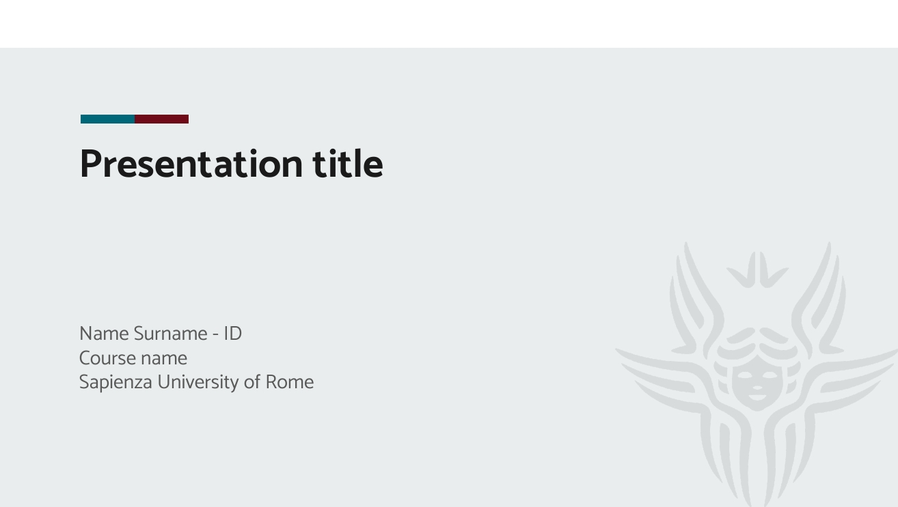
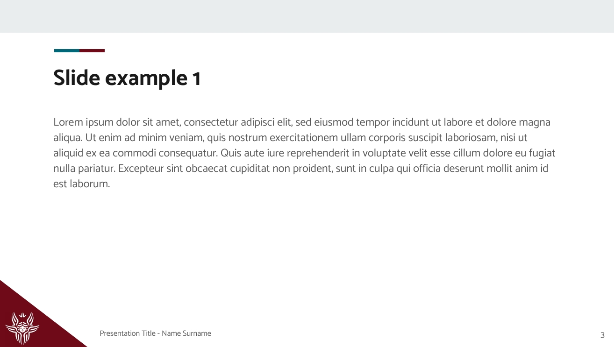

# sapienza-ppt-template :information_desk_person: :bar_chart: :computer: :mortar_board: :rocket:
## Introduction
This is a **unofficial** slide template for La Sapienza, University of Rome :star:.

It is developed on [google slides](https://docs.google.com/presentation/u/0/), therefore compatibility with Microsoft Power Point is not assured :sleepy:. 

Two themes are available:
[Light Theme](light/sapienza-ppt-template_light.pdf)           |  [Dark Theme](dark/sapienza-ppt-template_dark.pdf)
:-------------------------:|:-------------------------:
 |  
 | 

## How to use it
There are two possibilities:
- Generate a copy of the template in google slides choosing between [light](https://docs.google.com/presentation/d/1t6adiSpkEV6RKvrBBEbmBLQuyo7_mFRGFxlDhTsd0gg/edit?usp=sharing) or [dark](https://docs.google.com/presentation/d/16tPIHM18IIH0M_7TLbfi9AystdOMg06r1dSINDEEPl4/edit?usp=sharing) theme.
- Simply download the repository and open the `.pptx` or `.odp` file with your favourite software. 

## License
This template is released under the `BY-NC-SA` Creative Common license: [Attribution-NonCommercial-ShareAlike 4.0 International](https://creativecommons.org/licenses/by-nc-sa/4.0/).
Thus, you are free to:
- **Share** — copy and redistribute the material in any medium or format
- **Adapt** — remix, transform, and build upon the material  

--- 

I would like to thank Sapienza NLP Group from which I took the initial inspiration :bow:. 
